[返回](./index)
 
 + 创建/导入账号
 
  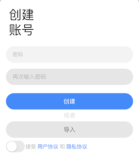
    
    
        成功下载app之后，需要首先创建账号，创建账号之前需要首先创建账号，该账号无需属于用户名。
    这是一个完全无服务器的管理的账号，该账号的密码没有保存到任何服务器上，也不保存在本地。该账
    号其实是一个区块链地址，该地址可以管理钻石（以太坊*10000倍）和BT积分，是完全的去中心化的账
    号体系。为了验证该账号的区块链特性，可以将网络关闭或者调整到飞行模式进行创建，毫不影响该账
    号的创建过程和使用。创建之前用户需要首先同意用户使用协议和隐私协议，点击左下角的开关，以表示
    您同意该产品的相关约束。
        如果您之前有过BPassword的账号，可以通过导入账号的方式将其它平台(目前支持安卓，IOS，浏
    览器插件)的账号导入到当前的app内，如果其它平台使用的账号已经是会员，那么导入本app之后依然是
    会员。如果其它平台的数据您提交过区块链，那么本app也将从区块链的任意节点获取账号下的所有数据，
    这些数据都是通过账号的私钥进行加密的，因此请在保存好账号二维码的前提下，记录好本app的账号，
    只有本账号的所有者才能解开存放在区块链(或者本地)的账号密码信息本app的宗旨就是通过记住一个密
    码的方式，管理好所有其他账号的密码，但是我们不支持本app密码的找回功能。

+ 添加内容

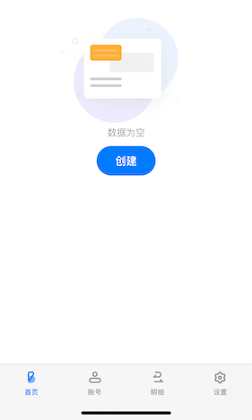  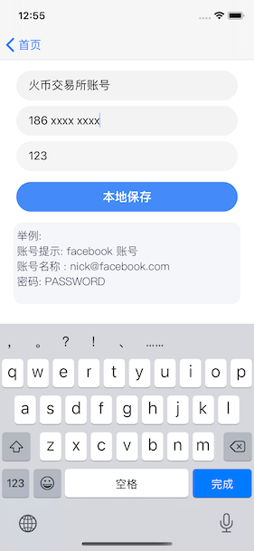

        如果第一次使用本APP，则创建账号后即可使用。本APP支持离线模式，在此模式下，既不需要会员
    身份也不需要链接任何网络。
    
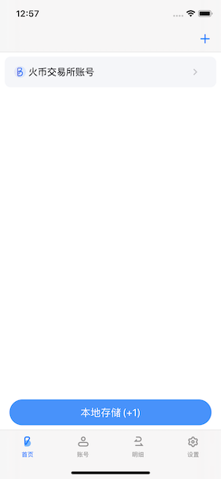  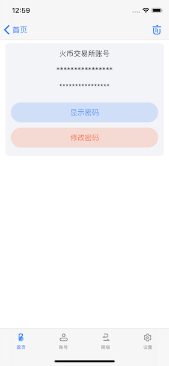

       通过区块链账号的私钥对数据进行加密，点击保存到本地之后，这些加密之
    后数据就会保存到本地磁盘。即使丢失手机，只要无法破解本app的区块链私钥，就无法破解您手机上的
    账号信息，即使破解了手机本身的安全防护(破解操作系统的账号体系，读取硬盘数据）。已无法破解存储
    在手机上的账号信息，破解该信息的难度与破解丢失的比特币钱包一样困难。

+ 查看数据

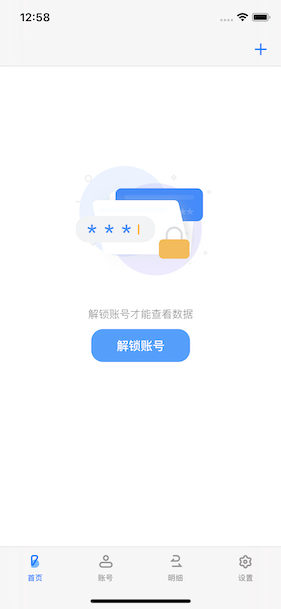  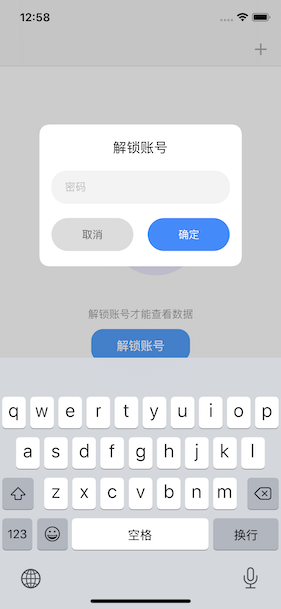

    应用程序每次退出之后，所有的数据就会处于加密状态，只有输入本APP的秘钥解锁之后才能够查看

+ 修改数据
    
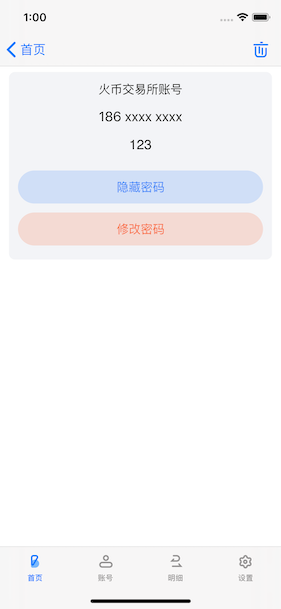  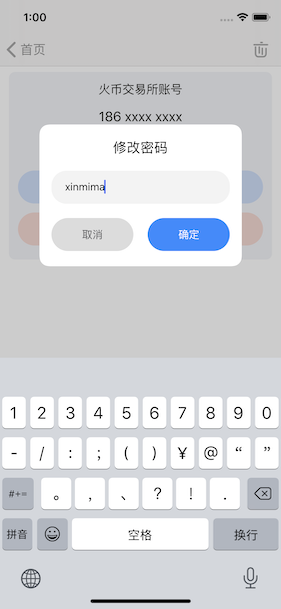
        
        如果用户的密码发生过变化，可以通过修改密码按钮来及时更新本密码保存器。需要注意的是，
    此处的修改密码并不是修改本APP的密码，而是修改您记录的互联网账号的密码，即该条目的账号对应的密码。
    
+ 充值会员

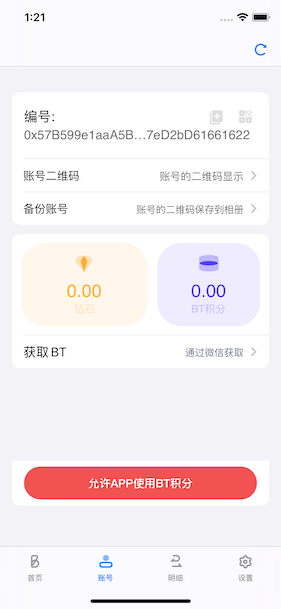 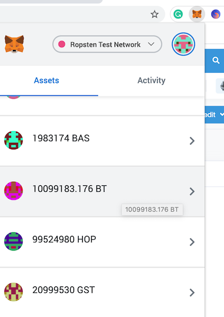

    在非会员的状态下,所有的账号信息都是保存在本地磁盘，在这种情况下会有几个缺点：
        1. 不支持数据的同步, 即无法同步到其他终端
        2. APP删除后数据丢失
        3. APP升级之后可能会丢失
    
        为了能够解决以上缺点，用户可以选择成飞付费用户，成为付费用户之前，首先确保账号下有钻石可以申
    请成为会员。钻石是以太坊的数量乘以10000倍，这样做是为了方便显示数据。在账号界面下，有个ID一栏，
    该ID就是以太坊的区块链地址，该栏中有两个小按钮，这两个按钮分别表示复制ID和显示ID的二维码的功能。
    复制或者显示该地址之后，通过IMtoken或者其他数字货币交易所，将以太坊数字火币ETH转入该地址接口使用
          
        ETH是为了将操作以太坊公链而奖励矿工的数字货币，该数字货币的消耗取决于当前的挖矿难度和网络的
    拥堵程度，与本APP的BT消耗无关，只有拥有了ETH，该APP与区块链的各种交互操作才能进行。比如红色按钮
    表示的"允许APP使用BT积分"功能，该功能表示授权本APP可以对该ID(以太坊账号)下的BT进行充值，该授权
    操作会写入到区块链公链上，因此需要消耗以太坊的gas才能够完成，消耗的gas就是本APP中显示的钻石。
     
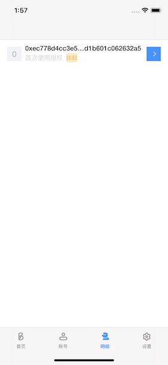  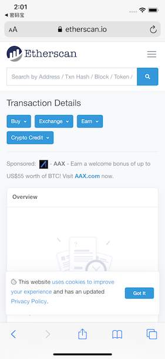

        在成功转入钻石之后，点击"允许APP使用BT积分"按钮，该操作会产生一条区块链交易记录，以证明用户
    同意 本app使用BT积分进行会员充值，该交易可以通过区块链进行查询。点击交易列表中的蓝色按钮，app会
    跳转到区块链浏览器展示该交易的详细状况，本APP也会定时更新该交易的最新状态。任何一款区块链浏览器
    都可以查询该交易的状态，不局限于本APP提供的区块链浏览器，复制交易HASH值即可查询。
    
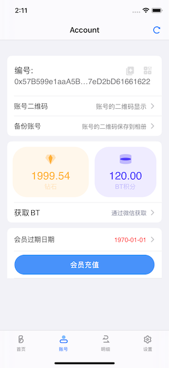  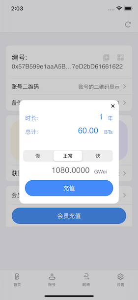  

        在成功充值钻石(ETH)和BT积分, 并授权APP使用BT积分之后，账号界面会显示当前会员的到期日期，
    对于新建账号，当前会员日期显示红色，表示是无效的会员身份。点击"会员充值"，可以显示一年会员需要
    消耗的BT积分数。该价格会因为项目发展的不同阶段，制定不同的会员价格，上图仅供参考。下方的"慢"、
    "正常"、"快"表示充值会员这个操作，在区块链上进行确认的速度，速度越快，消耗的钻石就越多，下方的
    数据表示当前区块链操作的GAS费用价格，此术语术语区块链专业术语，在此不再赘述。
        选择充值之后，也会产生一笔区块链交易，该交易的概述会在"明细"界面展示，其状态表明了充值的
    进展。当充值成功之后，账号界面会显示会员身份的到期日期，交易界面也会显示交易的最新状态。当成为
    会员之后，就可以返回到首页，将本地保存的账号隐私信息上传到区块链上了。
    
        在介绍上传区块链操作之前，首先补充介绍一下账号界面的其他元素，除了ID(即以太坊区块链地址之外)，
    可以点击账号二维码来显示当前账号的信息，该信息尽量不要传给第三方，自己保存好，更不要将本APP的账
    号密码与该二维码保存在一起，凡是同时取得该二维码和本APP密码的人，都可以获取该账号下的所有数据的
    解密数据，因此请慎重保管。该二维码可以用于其它平台的BPassword导入账号使用，与区块链账号的操作
    方式是一致的。
    
        备份账号操作会将本账号的二维码图片保存到相册中，用户可以将该二维码通过相册保存或者传递到其它
    属于自己的IT设备上，也可以将其打印之后保管。除了显示钻石和BT积分余额之外，获取Token的选项提供了
    一个微信二维码，对于大部分不熟悉区块链操作的朋友，可以加该微信来学习如何使用该产品，也可以通过该
    客服微信获取BTtoken和钻石。
     
 

>客服二维码

+ 提交数据

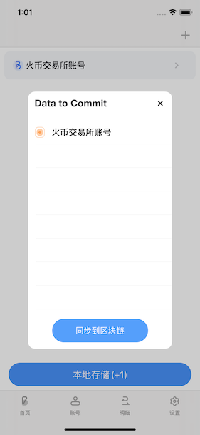  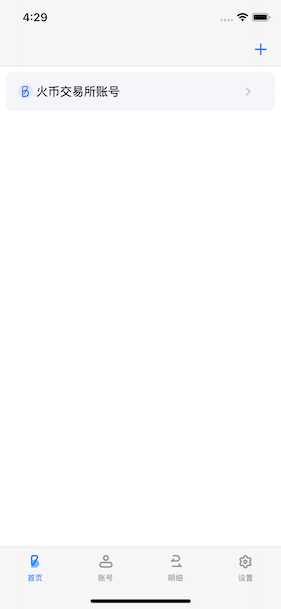  
    
        回到首页，点击本地存储按钮，会显示当前存储在本地的，尚未提交到区块链的数据内容，点击同步到区
    块链按钮，会产生一笔交易，等待该交易被区块链矿机确认之后，数据就会提交到区块链被永久储存。存储
    成功之后，首页不再显示本地存储的提示。
        对于导入账号的用户，通过下拉首页的列表，就可以更新到区块链上最新的数据，如果多个终端公用一个
    账号，在其它终端提交数据到区块链的情况下，首页列表的下拉操作也可以更新到其它终端提交的加密数据。

+系统设置

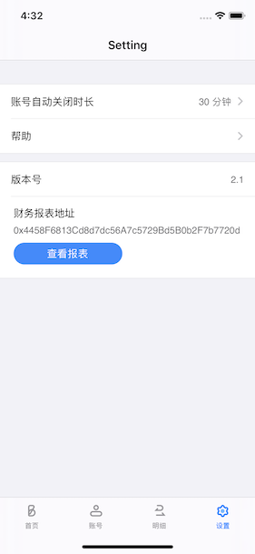
    
        系统设置界面展示了当前的相关设置，账号自动关闭时长表示：账号解锁之后，如果超过该字段描述的时间
    没有任何加密解密的操作，系统将会自动将账号锁定，以防止长时间未操作手机而导致数据泄露。在进程退出后，
    账号也会自动锁定，一般对于手机，锁屏后就不再有泄露账号的问题，但是对于未设置自动锁屏时间的手机，定
    时关闭该APP的账号还是有必要的。
        点击帮助按钮会跳转到本网站的首页，用户可以通过这里获取帮助或者下载到相关平台APP。版本号显示了当
    前APP的最新的系统版本号，如果版本过低时，请自行到相关平台下载最新的APP以保证账号的安全可靠。财务报表
    地址实际上就是该积分的区块链地址，点击该栏目会自动复制该积分地址。点击查看报表会跳转到区块链浏览器，
    区块链本质上是一个分布式账本，本APP充分利用了区块链的去中心化，加密传输以及分布式账本等技术，以独特
    的视角和产品设计，展示了分布式技术在未来商业领域的可行性以及巨大优势，BT积分不仅仅是一款应用工具，还是
    一款用来解释分布式商业和分布式投融资的具象的产品。