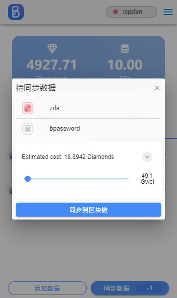
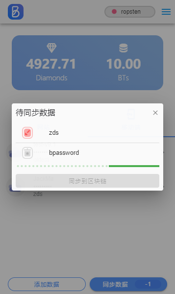

[返回](./index)

> BPassword 插件除了可以管理在ios或安卓APP存储的账号条目信息外,还增加了WEB网站的账号条目信息管理功能,同时可以自动回填网站登录框.

> 另外插件支持以太主网和Ropsten测试网切换

## 插件安装

> chrome 网上应用店下载,点[此链接](https://chrome.google.com/webstore/detail/bpassword/bacldcokcfmemiljlckpeokehiloamcj)

> Firefox 插件市场下载,点[此链接](https://addons.mozilla.org/zh-CN/firefox/addon/bpassword/)

## 插件使用

> 安装完成后可在浏览器右上角找到BPassword图标 

### 创建/导入账号

 

        成功安装插件之后，需要首先创建账号，创建账号之前需要首先创建账号，该账号无需属于用户名。这是一个完全无服务
    账号,其实是一个区块链地址，该地址可以管理钻石（以太坊*10000倍）和BT积分，是完全的去中心化的账号体系。为了验证
    该账号的区块链特性，可以将网络关闭进行创建，毫不影响该账号的创建过程和使用。

        如果您之前有过BPassword的账号，可以通过导入账号的方式将其它平台(目前支持安卓，IOS，安卓)的账号导入到当前
    的插件内，如果其它平台使用的账号已经是会员，那么导入本插件之后依然是会员。如果其它平台的数据您提交过区块链，那
    么本插件也将从区块链的任意节点获取账号下的所有数据，这些数据都是通过账号的私钥进行加密的，因此请在保存好账号二
    维码或导出keystore的前提下，记录好本插件的账号，只有本账号的所有者才能解开存放在区块链(或者本地)的账号密码信息
    本插件的宗旨就是,通过记住一个密码的方式，管理好所有其他账号的密码，但是我们不支持本app密码的找回功能。

###  通过插件添加/修改/删除内容

   

        如果第一次使用本插件，则创建账号后即可使用。本插件支持离线模式，在此模式下，既不需要会员身份也不需要链接任
    何网络。

        通过区块链账号的私钥对数据进行加密，点击保存到本地之后，这些加密之后数据就会保存到本地磁盘(浏览器数据存储
    空间,只要本插件不被移除,加密数据不会丢失)。只要无法破解本本插件的区块链私钥，就无法破解您插件上的
    账号信息,也无法破解存储在插件上的账号信息，破解该信息的难度与破解丢失的比特币钱包一样困难。

### 通过网站登录界面添加,修改数据内容

        打开你要管理的网站登录页,如某购物网站[passport.jd.com] ,在登录框内填写用户名和密码, BPassword 就会弹出
    添加账号信息页面.如下图.

   

        填写提示信息后点击保存,即可将京东登录账号添加到 BPassword 管理.添加完成后,再次打开网站登录时,就会提示账号
    自动填充.如下图:

  

 **注意**: 如果网站登录页面的账号和密码均已填有信息,且与 BPassword 管理的账号没有匹配时,不会弹出提示框. 如果你之前已用浏览器自带密码管理功能存储过密码,BPassword 弹出框会被浏览器自带弹出框覆盖.

## BPassword 会员

> 如果您希望本地保存的数据与ios 或安卓APP共享,您可以成为BPassword会员,并将数据保存到区块链上. 

    在非会员的状态下,所有的账号信息都是保存在本地磁盘，在这种情况下会有几个缺点：
        1. 不支持数据的同步, 即无法同步到其他终端
        2. 插件删除后数据丢失
        3. 插件升级之后可能会丢失

        为了能够解决以上缺点，用户可以选择成为付费用户，成为付费用户之前，首先确保账号下有钻石可以申
    请成为会员。钻石是以太坊的数量乘以10000倍，这样做是为了方便显示数据。在账号界面下，有个ID一栏，
    该ID就是以太坊的区块链地址，该栏中有两个小按钮，这两个按钮分别表示复制ID和显示ID的二维码的功能。
    复制或者显示该地址之后，通过IMtoken或者其他数字货币交易所，将以太坊数字火币ETH转入该地址接口使用
        
        ETH是为了将操作以太坊公链而奖励矿工的数字货币，该数字货币的消耗取决于当前的挖矿难度和网络的
    拥堵程度，与本APP的BT消耗无关，只有拥有了ETH，该APP与区块链的各种交互操作才能进行。比如红色按钮
    表示的"允许APP使用BT积分"功能，该功能表示授权本APP可以对该ID(以太坊账号)下的BT进行充值，该授权
    操作会写入到区块链公链上，因此需要消耗以太坊的gas才能够完成，消耗的gas就是本APP中显示的钻石。

### 查看账号下钻石和BT余额

### 会员充值

 

### 同步数据

 

    同步本地数据到区块链上需要消耗一定量的钻石费用.钻石费用可以在一定区间调节,注意过低的钻石费用可能会导致
提交失败.

 

### 导出 BPassword 主账号信息

    - 调出 BPassword 插件(点浏览器右上角 BPassword 图标)
    - 点击插件右上角更多功能按钮,选择导出账号
    - 输入密码宝主账号密码后进入导出账号页面

